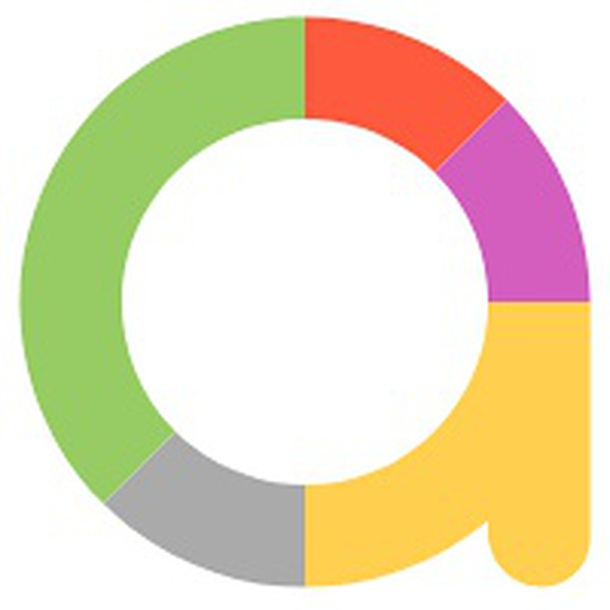
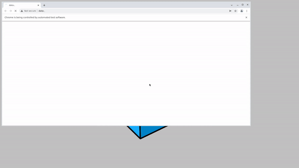
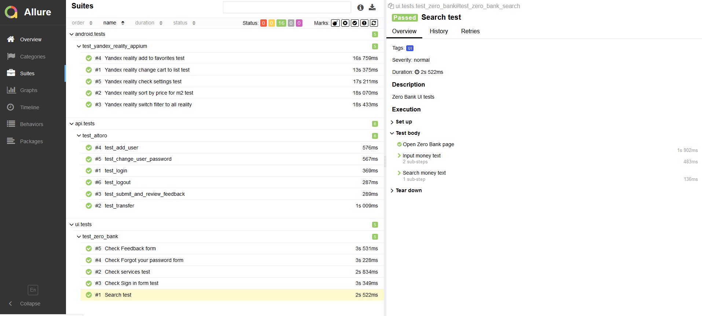

# Автотесты для сайтов

* UI - http://zero.webappsecurity.com
* API - http://demo.testfire.net

# Автотесты для мобильного приложения

* Яндекс.Недвижимость

## Покрыт следующий функционал
* UI тесты - http://zero.webappsecurity.com
    * ✅ Проверка поиска по сайту
    * ✅ Проверка меню с дополнительными службами
    * ✅ Проверка формы рагистрации
    * ✅ Проверка функционала восстановления пароля
    * ✅ Проверка работы формы отзывов
    

* API тесты - http://demo.testfire.net
  * ✅ Проверка логина нас сайт
  * ✅ Проверка получения списка трансферов из личного кабинета пользователя
  * ✅ Проверка формы обратной связи
  * ✅ Проверка добавления пользователя
  * ✅ Проверка изменения пароля пользователя
  * ✅ Проверка разлогина 

* Android тесты - Яндекс.Недвижимость
  * ✅ Изменение отображения карты в формат списка
  * ✅ Проверка работы сортировки в приложении
  * ✅ Проверка работы фильтров в приложении
  * ✅ Проверка добавления в избранное
  * ✅ Проверка настроек приложения


## Технологический стек
Python, Pytest, Selene, PyCharm, Requests, Appium, Jenkins, Selenoid, Allure TestOps, Jira, Github, Telegram

<p  align="left">
<code>
  
  
  
  
  
  
  
  
  
  
  
  
</code>
</p>

## Как запустить
Перед выполением необходимо:
* в .env определить параметры конфигурации:
    - login, password for selenoid
    - apiUrl (url address for API tests)
    - app(path to mobile app, in diploma:'./YandexReality.apk')
    - appName (name of mobile app, in diploma:'com.yandex.mobile.realty')
    - appWaitActivity (WaitActivity for mobile app, in diploma:'com.yandex.mobile.realty*')
    - platformName (platform name for mobile app, in diploma:'android')
    - platformVersion (platform version for mobile app, in diploma:'11')
    - deviceName (device name for mobile app, in diploma:'Pixel_4_API_30')
    - remoteUrl (url address from selenoid or grid, default: 'http://127.0.0.1:4723/wd/hub')


### Локально
```
pytest .
```

### Удаленно
```bash
ls -la
python -m venv .venv
source .venv/bin/activate
pytest ${TESTS_FOLDER} --browser_version=${BROWSER_VERSION}
```

### Видео о прохождении тестов


### Запуск в Jenkins
Статистика по запускам <br >
<a href="https://ibb.co/TvwPjzj"></a>

Параметры запуска <br >
<a href="https://ibb.co/THr4VDp"></a>

### Отчёт о прохождении автотестов в Allure Report

### Список автотестов в Allure Report

### Хранение тестовой документации в Allure TestOps

### Интерграция с Jira

### Уведомления о прохождении автотестов в Telegram
